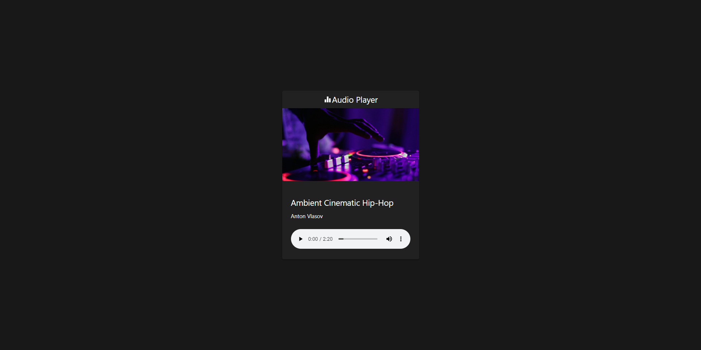

# Trabalhando com HTML Áudio, CSS e JavaScript

**Este projeto é um estudo baseado no conteúdo do canal da Rocketseat no YouTube.**

## Audio Player
Ao longo do vídeo é explicado como usar a tag de áudio HTML5, que permite criar um reprodutor de áudio, utilizando Javascript puro e o Materialize como um framework CSS.

Para mais informações, veja [Criando Player de Áudio com Javascript | Mayk Brito](https://www.youtube.com/watch?v=vqrjFnq3-uo).